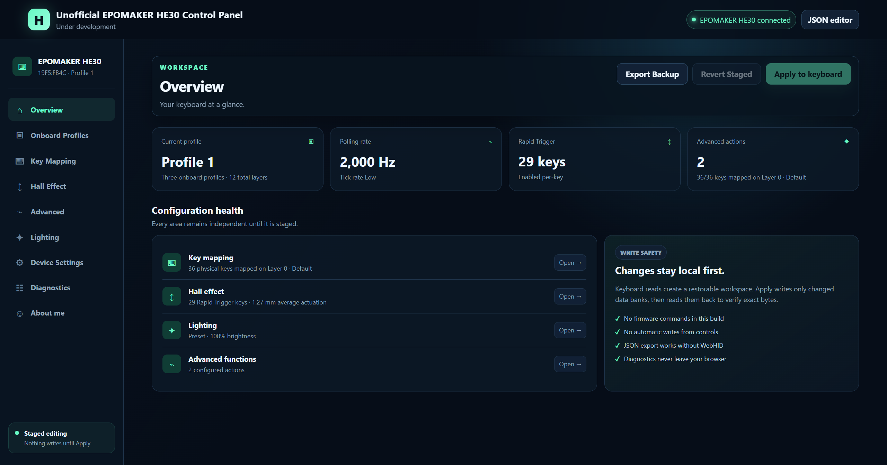
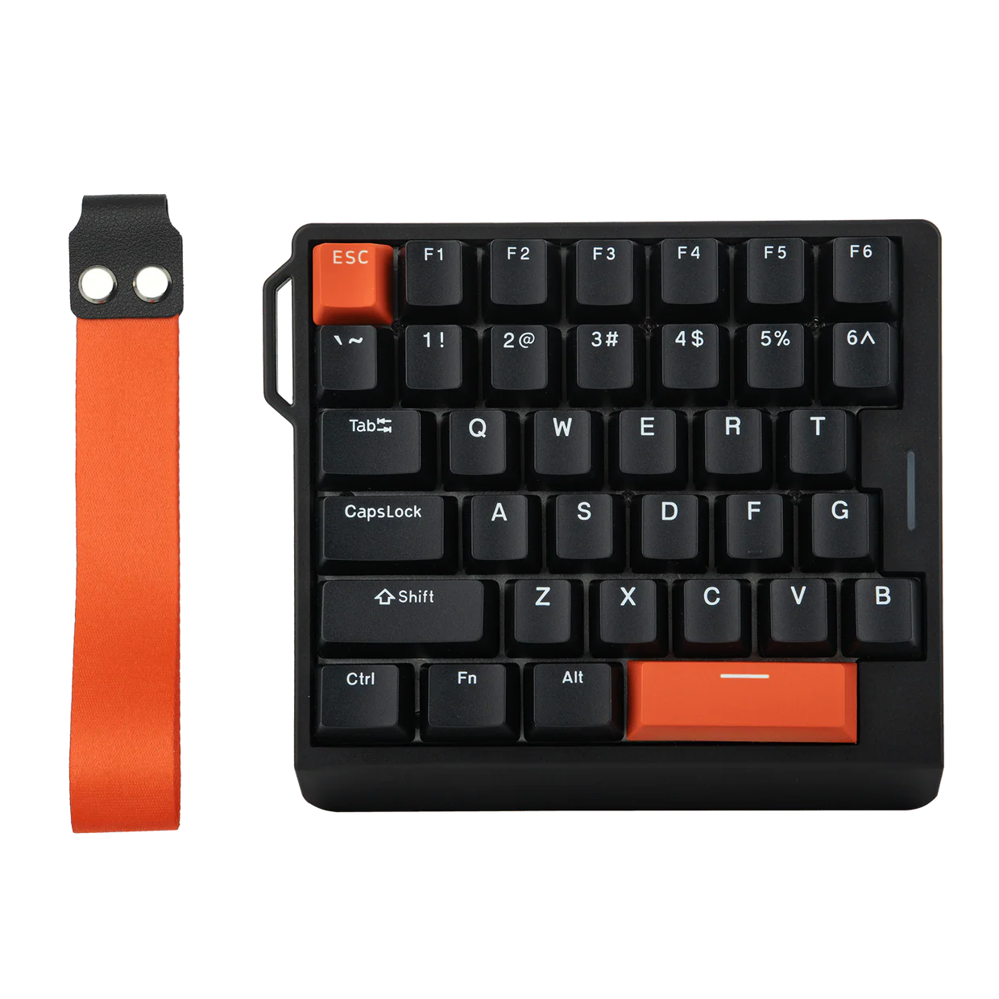
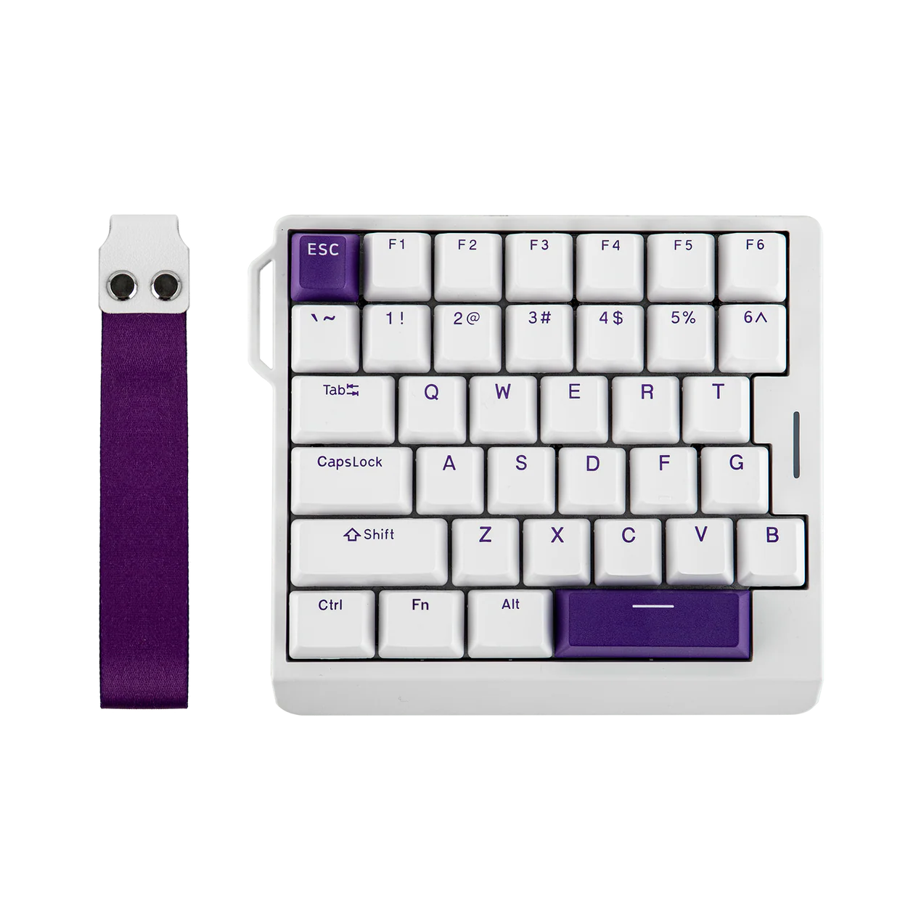

<table>
  <tr>
    <td></td>
    <td></td>
  </tr>
</table>

# Custom Web Driver for EPOMAKER HE30 Keyboard

A simple web-based configuration tool for supported Epomaker HE30-family Hall-effect keyboards.

Use it to change key mappings, Hall-effect settings, lighting, profiles, macros, and other keyboard options directly from your browser. Nothing needs to be installed, and your keyboard data stays on your computer.

> [!IMPORTANT]
> Firmware updates and bootloader flashing are not supported.

## Open the Driver

Open the web driver here:

[**Launch HE30 Control**](https://z750sasr.github.io/epomaker-he30-alternate-web-driver/)

For live keyboard configuration, use a desktop version of:

* Google Chrome
* Microsoft Edge
* Another Chromium-based browser with WebHID support

Firefox and Safari do not currently support WebHID, but they can still be used with the offline JSON editor and demo mode.

## WHy do I make this when we already have the manufacturer's driver?

- Added (experimental) settings that are not displayed.
- Added new features, QoLs.
- Added new key map: MacOS's Siri and Launchpad keys, additional F13 to F24 keys for those nerds.
- Maybe better UX/UI interface? (subjective)
- Maybe one day, the manufacturer will end the suppport for this keyboard and shut the website down, but this project is deployed on GitHub, so maybe this would stay forever (unless the world is coming to and end or some god-level hacker vaporizes GitHub.
- Miscs, blah blah blah


## Let's be real, who wants to read AI generated stuff? If you are, then read the part below.

- Direct WebHID connection for normal configuration mode
- Complete JSON profile import and export on the dedicated `/json_editor/` route
- Twelve remap layers across three profiles, with FN/FN1–FN11 targets, F1–F24, media, mouse, and internal functions
- Per-key Hall actuation, Rapid Trigger, supported travel resolution, and top/bottom dead zones
- Mouse, pen, and touch box-selection for tuning groups of Hall-effect keys together
- Live Hall travel monitor with per-key fill animation, switch cutaway, actuation marker, and millimeter readout
- Polling rate, tick rate, debounce, Windows/macOS mode, filtering, Tachyon, and shortcut locks
- All 24 original main-key lighting presets, all 5 light-strip effects, and their effect-specific controls
- Main-key lighting, the small light-strip zone, and saved colors for all 36 physical keys
- Live RGB framebuffer preview for all 36 keys, plus a live multi-segment light-strip preview synchronized from its onboard effect settings
- Onboard profile switching on multi-profile models
- Live profile and layer tracking: onboard profile-key presses automatically refresh every workspace page
- DKS, Mod-Tap, Toggle, Rappy Snappy, SOCD, combination keys, and macros
- Staged edits, explicit write confirmation, byte-for-byte read-back verification, and an in-browser recovery backup
- Local diagnostics and session-log export
- Automatic return to the connection screen when a connected keyboard is unplugged
- Browser keyboard-action suppression while hardware is connected, so Space, arrows, and remapped keys do not scroll or activate the page during testing

Firmware update and bootloader flashing are intentionally not included.

## Capture-derived compatibility notes

- The original driver exposes travel resolution only for device types `101`, `102`, `103`, and `105`. Type `104` keeps its stored precision bits but does not expose an editor in either the original interface or this app.
- The available resolution steps are `0.01 mm`, `0.005 mm`, and `0.001 mm` for types `102`, `103`, and `105`; type `101` omits `0.001 mm`.
- Config byte 7 bit 0 is read under the internal name `tachyonMode`, while its unused setter is named `setBerserkMode`. The captured production interface does not call that setter, so HE30 Control preserves the bit without offering a toggle.
- Live travel uses the original software's Dynamic Display mechanism: config byte 7 bit 3 enables `0xA0` diagnostic reports. Starting the monitor enables that bit in the active profile's 64-byte config bank when necessary; stopping it restores the same profile bank. The stream is unavailable in JSON and demo workspaces.
- The same temporary Dynamic Display flag exposes command `0xDE`, a 384-byte RGB framebuffer. Its first 108 bytes are the live RGB triplets for the HE30's 36 physical keys. Captured HE30 firmware leaves the remaining slots zero, but the app watches the first 12 spare RGB slots for firmware variants that expose strip pixels there. Otherwise it refreshes the strip's real onboard effect settings from the profile config and renders a synchronized effect preview without writing to the device.
- The captured firmware layout exposes one saved per-key RGB bank per profile through commands `0x0A`/`0x0B`, while each profile has four separate key-mapping layers. `0xDE` has only been observed as a framebuffer read. Without a volatile RGB-frame write command or an onboard layer-to-lighting link, switching four static RGB banks on Fn press is not safe to implement; rewriting the saved bank on every press/release would be slow and could wear flash.
- The original factory-reset flow sends subcommand `0xEE` with the active profile index (`0`–`2`), or `0xFF` for every onboard profile; the all-profile operation also clears macros. HE30 Control includes typed protocol helpers for these two scopes, but its reset controls remain disabled until a matching default-profile JSON file is bundled and its schema is validated.

## Supported Devices

| Model         | VID:PID     | Supported Profiles                    |
| ------------- | ----------- | ------------------------------------- |
| Epomaker HE30 | `19F5:FB4C` | Three profiles, with four layers each |

Based on AI Analysis, the original driver site https://epomaker.keybord.net.cn/ also supports 2 more models:
| Epomaker GT60 | `19F5:FB79` | One profile                           |
| Epomaker HE30 | `19F5:FB27` | One profile                           |

Only normal keyboard-configuration interfaces are requested.

Firmware-updater and bootloader device IDs are not included in the application.

## Disconnect and Testing Behavior

If the keyboard is unplugged while connected, the driver automatically returns to the connection screen.

While the keyboard is connected, the webpage also suppresses normal browser actions caused by keyboard input. This prevents keys such as Space, arrow keys, or remapped keys from scrolling the page or activating webpage controls while you test them.

## Running Locally

The hosted version is recommended for most users.

To run the driver locally, WebHID requires a secure context. Use `localhost` instead of opening `index.html` directly.

From the project directory, run:

```powershell
python -m http.server 4173
```

Then open:

```text
http://localhost:4173
```

For the offline JSON editor, open:

```text
http://localhost:4173/json_editor/
```

JSON-only mode and demo mode do not require WebHID.

## Technical Compatibility Notes

These details are mainly useful for developers and advanced users.

* The original driver exposes travel-resolution controls only for device types `101`, `102`, `103`, and `105`.
* Device type `104` retains its stored precision bits, but neither the original driver nor this application exposes a resolution editor for it.
* Device types `102`, `103`, and `105` support `0.01 mm`, `0.005 mm`, and `0.001 mm` resolution options.
* Device type `101` supports `0.01 mm` and `0.005 mm`, but not `0.001 mm`.
* Config byte 7, bit 0 is read internally as `tachyonMode`.
* The unused setter for that bit is named `setBerserkMode`.
* The captured production interface does not use that setter, so this driver preserves the stored value without exposing a separate toggle.
* The live travel monitor uses the original software's Dynamic Display mechanism.
* Config byte 7, bit 3 enables `0xA0` diagnostic reports.
* Starting the live monitor enables that bit in the active profile's 64-byte configuration bank when required.
* Stopping the monitor restores the same profile bank.
* Live diagnostic travel data is not available in JSON-only or demo workspaces.

## Development Checks

Developers can run the dependency-free smoke test using Node.js:

```powershell
node smoke-test.cjs
```

The test checks:

* JavaScript syntax
* Protocol-codec round trips
* Device filters
* Requested mappings
* Advanced-bank limits
* Static asset links
* The intentional absence of firmware-update functionality
