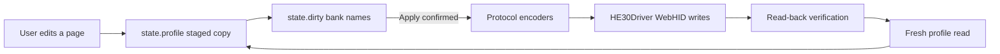

# HE30 Control architecture

This guide is the recommended starting point for a new contributor. The project
uses plain HTML, CSS, and JavaScript so it can run directly from GitHub Pages.
There is no package install, bundler, framework, or generated application bundle.

## The five-minute mental model

The application has three layers:

1. **Page and editor code** renders the current profile and stages user changes.
2. **Protocol codecs** translate friendly JavaScript objects to and from firmware
   byte arrays.
3. **The WebHID driver** sends those bytes, reads them back, and verifies that the
   keyboard stored exactly what the app requested.



The most important safety rule is that editing the UI does **not** immediately
write to the keyboard. A change updates `state.profile` and adds one or more bank
names to `state.dirty`. Only the final Apply confirmation calls the driver.

## Source map

### Application modules

The scripts are loaded in this exact order by both `index.html` and
`json_editor/index.html`:

| File | Responsibility |
| --- | --- |
| `js/app/foundation.js` | Keyboard layout, mapping catalogs, central state, profile normalization, shared render dispatcher |
| `js/app/pages.js` | HTML for every page plus listeners attached after a page render |
| `js/app/hall.js` | Distance inputs, Hall selection, live travel, and calibration |
| `js/app/lighting.js` | Live RGB polling, smoothing, strip simulation, and color previews |
| `js/app/editors.js` | Mapping modal and all Advanced-action editors |
| `js/app/profiles.js` | Device connection, live profile switching, imports, sharing, and factory reset |
| `app.js` | Apply/revert, teardown, permanent shell listeners, and startup |

These are **ordered classic scripts**. They intentionally share top-level
declarations without a build step. Do not add `type="module"`, change their order,
or load one with `async`. If the project later adopts a bundler, these boundaries
are also natural ES-module boundaries.

### Protocol modules

| File | Responsibility |
| --- | --- |
| `js/protocol/core.js` | Constants, supported devices, mapping names, report decoders, and Wooting conversion |
| `js/protocol/codecs.js` | Firmware-bank encoders/decoders, compressed sharing, and Advanced-action compilation |
| `protocol.js` | The `HE30Driver` WebHID transport and public `window.HE30Control` export |

Protocol functions are kept separate from the UI. A codec should accept values
and return values without reading the DOM. This makes it possible to test nearly
all binary behavior without a physical keyboard.

### Stylesheets

Styles are also ordered from broadest to most specific:

| File | Responsibility |
| --- | --- |
| `styles.css` | Design tokens, global elements, top bar, and connection screen |
| `styles/workspace.css` | Sidebar, workspace shell, panels, and overview |
| `styles/keyboard-hall.css` | Shared keyboard, Hall editor, calibration, and live monitor |
| `styles/pages.css` | Lighting, Advanced, profiles, sharing, and settings |
| `styles/components.css` | Diagnostics, About, forms, dialogs, and progress UI |
| `styles/responsive.css` | Breakpoint overrides; this must remain last |

## Startup flow

1. `index.html` creates the permanent shell, dialogs, progress overlay, and toast.
2. Protocol scripts load and expose `window.HE30Control`.
3. Application scripts define data and functions in order.
4. `app.js` calls `renderMiniKeyboard()` and `bindStaticControls()`.
5. Connecting, loading JSON, or opening demo mode calls `setWorkspace()`.
6. `setWorkspace()` normalizes data, stores staged and rollback copies, and calls
   `renderPage()`.
7. `renderPage()` replaces the page body, then `bindPageControls()` attaches
   listeners to the newly created elements.

This explains why there are two binding functions:

- `bindStaticControls()` runs once for elements that live in the HTML document.
- `bindPageControls()` runs after every page render because those elements were
  just replaced.

## Profile data model

`normalizeProfile()` makes every input use the same shape. The important fields
are:

```js
{
  profileIndex: 0,            // onboard profile 0, 1, or 2
  userKeys: {
    0: [/* 128 mappings */],  // four local layers per profile
    1: [/* 128 mappings */],
    2: [/* 128 mappings */],
    3: [/* 128 mappings */]
  },
  travelKeys: [/* 128 Hall records */],
  advancedKeys: [/* editor-friendly actions */],
  light: {/* main-key effect */},
  logoLight: {/* light-strip effect */},
  colorKeys: [/* 128 saved RGB colors */],
  deviceSettings: {/* profile config values */},
  _rawConfig: [/* original 64 config bytes */]
}
```

The firmware reserves 128 key slots even though the HE30 exposes 36 physical
keys. UI layout uses `HE30_LAYOUT`; codecs always preserve the full banks.

Each onboard profile owns four local mapping layers. Their global Fn numbers are:

| Profile | Local layers | Global Fn targets |
| --- | --- | --- |
| Profile 1 | 0–3 | FN / FN1 / FN2 / FN3 |
| Profile 2 | 0–3 | FN4 / FN5 / FN6 / FN7 |
| Profile 3 | 0–3 | FN8 / FN9 / FN10 / FN11 |

Use `globalLayerNumber()` in UI code and the translation helpers in protocol code
instead of manually adding offsets.

## Staging and writing

The staged profile and device profile are deliberately separate:

- `state.profile` is the editable working copy.
- `state.original` is the most recent trusted snapshot for Revert.
- `state.dirty` contains bank groups such as `keymap`, `hall`, or `lighting`.

An editor normally follows this pattern:

```js
state.profile.someValue = newValue;
markDirty("settings");
renderPage();
```

At Apply time, `HE30Driver.writeProfile()`:

1. compiles Advanced actions and their host references;
2. creates write tasks only for dirty bank groups;
3. writes each task in 56-byte chunks;
4. reads the same range back;
5. rejects the operation if any byte differs; and
6. returns a fresh full profile read.

Never bypass `writeAndVerify()` for a persistent configuration write.

## Advanced actions

The UI stores friendly objects such as DKS, Mod-Tap, Toggle, Rappy Snappy, SOCD,
combination keys, and macros. Firmware stores these in fixed-capacity banks and
puts a special reference mapping on each host key.

`compileAdvanced()` performs the friendly-to-firmware conversion. It also clones
the profile, so validation cannot accidentally mutate the staged workspace.
`decodeAdvanced()` reverses the process after reading the keyboard.

Advanced actions keep `_baseMapping1`, `_baseMapping2`, and sometimes original
Hall values as UI metadata. Those backups allow Delete to restore the key that
existed before the action was assigned. Be careful not to discard these fields
during a live profile refresh.

## Live reports and concurrency

Normal commands expect a response report, but telemetry and profile-change
reports can arrive at any moment. `HE30Driver.onInputReport()` recognizes those
asynchronous reports first and sends them to subscribers. Only an ordinary
response is passed to a waiting command.

`transact()` uses a promise chain to serialize commands. Callers may start async
operations close together, but only one WebHID transaction is active at a time.

Live Hall monitoring temporarily enables the firmware's Dynamic Display flag.
The driver remembers whether it enabled that flag and restores it on stop. Switch
calibration and normal live monitoring are mutually exclusive.

## Adding a feature

### Add a new page control

1. Render its markup in `js/app/pages.js`.
2. Bind its transient listener inside `bindPageControls()` or the relevant
   feature binder.
3. Update `state.profile`, call `markDirty()` with the correct bank group, and
   rerender if the visible state changed.
4. Add a smoke-test assertion for the behavior or required surface.

### Add a protocol field

1. Identify its exact byte, mask, valid range, and profile offset from evidence.
2. Update both decode and encode/apply directions.
3. Preserve unrelated bits from `_rawConfig`.
4. Add a round-trip test and at least one known-byte assertion.
5. Only then expose the setting in the UI.

### Add a new source file

Keep files under 1,000 lines. Add the file in the correct order to:

- `index.html`;
- `json_editor/index.html`; and
- the matching file list near the top of `smoke-test.cjs`.

The smoke test enforces the source-file line limit and catches a missing load-list
entry on either route.

## Verification

Run the dependency-free regression suite from the repository root:

```powershell
node smoke-test.cjs
```

It checks syntax, binary round trips, mapping behavior, Advanced bank sizes,
profile sharing, Wooting conversion, safety restrictions, factory-config shape,
static asset load order, and the 1,000-line source-file limit.

When changing visible layout, also serve the project over HTTP and inspect both
the live route and `/json_editor/` at desktop and narrow widths. WebHID itself
requires a compatible Chromium browser and a secure context.

